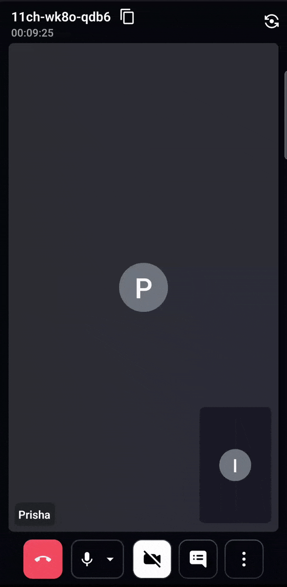
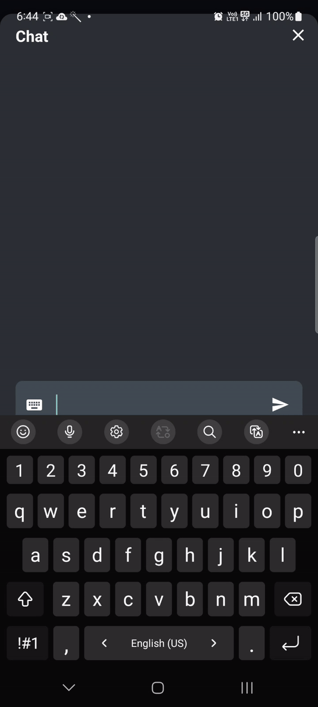

# 🚀 Video SDK for Android

[](https://docs.videosdk.live/android/guide/video-and-audio-calling-api-sdk/concept-and-architecture)
[](https://appdistribution.firebase.dev/i/99ae2c5db3a7e446)
[](https://discord.gg/bGZtAbwvab)
[](https://app.videosdk.live/signup)

At Video SDK, we’re building tools to help companies create world-class collaborative products with capabilities for live audio/video, cloud recordings, RTMP/HLS streaming, and interaction APIs.

### 🥳 Get **10,000 minutes free** every month! **[Try it now!](https://app.videosdk.live/signup)**

### ⚡️From Clone to Launch - Get Started with the Example in 5 mins!

[](https://youtu.be/ihF3vhKuPhk?si=64FmEMweWpzst99h "Java")

## 📚 **Table of Contents**

- [📱 **Demo App**](#-demo-app)
- [⚡ **Quick Setup**](#-quick-setup)
- [🔧 **Prerequisites**](#-prerequisites)
- [📦 **Running the Sample App**](#-running-the-sample-app)
- [🔥 **Meeting Features**](#-meeting-features)
- [🧠 **Key Concepts**](#-key-concepts)
- [🔑 **Token Generation**](#-token-generation)
- [🧩 **Project OverView**](#-project-overview)
- [📖 **Examples**](#-examples)
- [📝 **VideoSDK's Documentation**](#-documentation)
- [💬 **Join Our Community**](#-join-our-community)

## 📱 Demo App

📱 Download the sample Android app here: https://appdistribution.firebase.dev/i/99ae2c5db3a7e446

## ⚡ Quick Setup

1. Sign up on [VideoSDK](https://app.videosdk.live/) to grab your API Key and Secret.
2. Familiarize yourself with [Token](https://docs.videosdk.live/android/guide/video-and-audio-calling-api-sdk/authentication-and-token)

## 🛠 Prerequisites

- Development environment requirements:
  - [Java Development Kit](https://www.oracle.com/java/technologies/downloads/)
  - Android Studio 3.0 or later
- A physical or virtual mobile device running Android 5.0 or later
- Valid [Video SDK Account](https://app.videosdk.live/)


## 📦 Running the Sample App

### Step 1: Clone the Repository

Clone the repository to your local environment.

```js
git clone https://github.com/videosdk-live/videosdk-rtc-android-java-sdk-example.git
```

### Step 2: Open and Sync the Project

Open the cloned project in Android Studio and perform a project sync.

### Step 3: Modify local.properties

Generate a temporary token from your [**Video SDK Account**](https://app.videosdk.live/signup) and update the `local.properties` file:

```js title="local.properties"
auth_token = TEMPORARY-TOKEN
```

### Step 4: Run the sample app

Run the Android app by pressing Shift+F10 or by clicking the ▶ Run button in the Android Studio toolbar.

## 🔥 Meeting Features

Unlock a suite of powerful features to enhance your meetings:

| Feature                        | Documentation                                                                                                                | Description                                                                                                      |
|--------------------------------|------------------------------------------------------------------------------------------------------------------------------|------------------------------------------------------------------------------------------------------------------|
| 📋 **Precall Setup**           | [Setup Precall](https://docs.videosdk.live/android/guide/video-and-audio-calling-api-sdk/setup-call/precall)                   | Configure audio, video devices, and other settings before joining the meeting.                                              |
| 🤝 **Join Meeting**            | [Join Meeting](https://docs.videosdk.live/android/guide/video-and-audio-calling-api-sdk/setup-call/join-meeting)                | Allows participants to join a meeting.                                                                 |
| 🚪 **Leave Meeting**            | [Leave Meeting](https://docs.videosdk.live/android/guide/video-and-audio-calling-api-sdk/setup-call/leave-end-meeting)                | Allows participants to leave a meeting.                                                                 |
| 🎤 **Toggle Mic**         | [Mic Control](https://docs.videosdk.live/android/guide/video-and-audio-calling-api-sdk/handling-media/mute-unmute-mic)          | Toggle the microphone on or off during a meeting.                                                                  |
| 📷 **Toggle Camera**           | [Camera Control](https://docs.videosdk.live/android/guide/video-and-audio-calling-api-sdk/handling-media/on-off-camera)         | Turn the video camera on or off during a meeting.                                                                  |
| 🖥️ **Screen Share**            | [Screen Share](https://docs.videosdk.live/android/guide/video-and-audio-calling-api-sdk/handling-media/screen-share)          | Share your screen with other participants during the call.                                                      |
| 🔊 **Change Audio Device**     | [Switch Audio Device](https://docs.videosdk.live/android/guide/video-and-audio-calling-api-sdk/handling-media/change-input-output-device#changing-inputoutput-audio-device) | Select an input-output device for audio during a meeting.                                                                |
| 🔌 **Change Video Device**     | [Switch Video Device](https://docs.videosdk.live/android/guide/video-and-audio-calling-api-sdk/handling-media/change-input-output-device#changing-camera-input-device) | Select an output device for audio during a meeting.                                                                |
| ⚙️ **Optimize Audio Track**         | [Audio Track Optimization](https://docs.videosdk.live/android/guide/video-and-audio-calling-api-sdk/render-media/optimize-audio-track)                                       | Enhance the quality and performance of media tracks.                                                            |
| ⚙️ **Optimize Video Track**         | [Video Track Optimization](https://docs.videosdk.live/android/guide/video-and-audio-calling-api-sdk/render-media/optimize-video-track)                                       | Enhance the quality and performance of media tracks.                                                            |
| 💬 **Chat**                    | [In-Meeting Chat](https://docs.videosdk.live/android/guide/video-and-audio-calling-api-sdk/collaboration-in-meeting/pubsub)      | Exchange messages with participants through a Publish-Subscribe mechanism.                                                   |
| 📸 **Image Capture**           | [Image Capturer](https://docs.videosdk.live/android/guide/video-and-audio-calling-api-sdk/handling-media/image-capturer)        | Capture images of other participant from their video stream, particularly useful for Video KYC and identity verification scenarios.     |
| 📁 **File Sharing**            | [File Sharing](https://docs.videosdk.live/android/guide/video-and-audio-calling-api-sdk/collaboration-in-meeting/upload-fetch-temporary-file) | Share files with participants during the meeting.                                                               |
| 🖼️ **Virtual Background**        | [Virtual Background](https://docs.videosdk.live/android/guide/video-and-audio-calling-api-sdk/render-media/virtual-background)                                       | Add a virtual background or blur effect to your video during the call.                                                            |
| 📼 **Recording**               | [Recording](https://docs.videosdk.live/android/guide/video-and-audio-calling-api-sdk/recording/Overview)                | Record the meeting for future reference.                                                                        |
| 📡 **RTMP Livestream**         | [RTMP Livestream](https://docs.videosdk.live/android/guide/video-and-audio-calling-api-sdk/live-streaming/rtmp-livestream)        | Stream the meeting live to platforms like YouTube or Facebook.                                                  |
| 📝 **Real-time Transcription**           | [Real-time Transcription](https://docs.videosdk.live/android/guide/video-and-audio-calling-api-sdk/transcription-and-summary/realtime-transcribe-meeting) | Generate real-time transcriptions of the meeting.                                                               |
| 🔇 **Toggle Remote Media**     | [Remote Media Control](https://docs.videosdk.live/android/guide/video-and-audio-calling-api-sdk/control-remote-participant/remote-participant-media) | Control the microphone or camera of remote participants.                                                        |
| 🚫 **Mute All Participants**   | [Mute All](https://docs.videosdk.live/android/guide/video-and-audio-calling-api-sdk/control-remote-participant/mute-all-participants) | Mute all participants simultaneously during the call.                                                           |
| 🗑️ **Remove Participant**      | [Remove Participant](https://docs.videosdk.live/android/guide/video-and-audio-calling-api-sdk/control-remote-participant/remove-participant) | Eject a participant from the meeting.  |

## 🧠 Key Concepts

Understand the core components of our SDK:

- `Meeting` - A Meeting represents Real-time audio and video communication.

  **` Note: Don't confuse the terms Room and Meeting; both mean the same thing 😃`**

- `Sessions` - A particular duration you spend in a given meeting is referred as a session, you can have multiple sessions of a specific meetingId.
- `Participant` - A participant refers to anyone attending the meeting session. The `local participant` represents yourself (You), while all other attendees are considered `remote participants`.
- `Stream` - A stream refers to video or audio media content published by either the `local participant` or `remote participants`.


## 🔐 Token Generation

The token is used to create and validate a meeting using API and also initialize a meeting.

🛠️ `Development Environment`:

- You may use a temporary token for development. To create a temporary token, go to VideoSDK's [dashboard](https://app.videosdk.live/api-keys) .

🌐 `Production Environment`:

- You must set up an authentication server to authorize users for production. To set up an authentication server, please take a look at our official example repositories. [videosdk-rtc-api-server-examples](https://github.com/videosdk-live/videosdk-rtc-api-server-examples)

## 🧩 Project Overview

### App Behaviour with Different Meeting Types

- **One-to-One meeting** - The One-to-One meeting allows 2 participants to join a meeting in the app.

- **Group Meeting** - The Group meeting allows any number of participants to join a meeting in the app.

## 🏗️ Project Structure

- We have created 3 package screens and widgets in the following folder structure:
  - [`OneToOneCall`](app/src/main/java/live/videosdk/rtc/android/java/OneToOneCall) - It includes all classes/files related to OneToOne meetings.
  - [`GroupCall`](app/src/main/java/live/videosdk/rtc/android/java/GroupCall) - It includes all classes/files related to the Group meetings.
  - [`Common`](app/src/main/java/live/videosdk/rtc/android/java/Common) - It includes all the classes/files that are used in both meeting type.

### [Common package](app/src/main/java/live/videosdk/rtc/android/java/Common)

### 1. Pre-Call Setup on Join Screen

- [DeviceAdapter.java](app/src/main/java/live/videosdk/rtc/android/java/Common/Adapter/DeviceAdapter.java) : This is a custom `RecyclerView.Adapter` used to display a list of audio devices. It takes a list of devices and a click listener to handle item clicks. Each item shows the device name and an icon.

- [bottom_sheet.xml](app/src/main/res/layout/bottom_sheet.xml) : This layout defines the structure of the bottom sheet dialog, which contains a `RecyclerView` that displays the list of items. The `RecyclerView` fills the available space and references `list_items_bottom_sheet` for its individual list items.

- [list_items_bottom_sheet.xml](app/src/main/res/layout/list_items_bottom_sheet.xml) : This layout defines how each item in the bottom sheet looks. It contains a `LinearLayout` with an `ImageView` for the device icon, a `TextView` for the device label, and another `ImageView` for a checkmark icon. The checkmark is used to indicate the currently selected device.

<p align="center">

</p>

### 2. Create or Join Meeting

- [`NetworkUtils.java`](app/src/main/java/live/videosdk/rtc/android/java/Common/Utils/NetworkUtils.java) - This class is used to call the API to generate a token, create and validate the meeting.

- [`CreateOrJoinActivity.java`](app/src/main/java/live/videosdk/rtc/android/java/Common/Activity/CreateOrJoinActivity.java) and [`activity_create_or_join.xml`](app/src/main/res/layout/activity_create_or_join.xml) : This Activity allows users to either create or join a meeting. It manages microphone and webcam permissions and handles UI interactions like enabling/disabling audio and video. It also switches between the `CreateMeetingFragment` and `JoinMeetingFragment`, depending on user actions.

- [`CreateOrJoinFragment.java`](app/src/main/java/live/videosdk/rtc/android/java/Common/fragment/CreateOrJoinFragment.java) and [`fragment_createorjoin.xml`](app/src/main/res/layout/fragment_createorjoin.xml) : This fragment provides two buttons for users to either create or join a meeting. On button clicks, it transitions to the respective fragments (`CreateMeetingFragment` or `JoinMeetingFragment`) within `CreateOrJoinActivity`.

- [`CreateMeetingFragment.java`](app/src/main/java/live/videosdk/rtc/android/java/Common/fragment/CreateMeetingFragment.java) and [`fragment_create_meeting.xml`](app/src/main/res/layout/fragment_create_meeting.xml) : This fragment enables users to create a new meeting by selecting a meeting type (e.g., One-to-One or Group Call) and entering their name. Upon submission, it makes a network request to create a meeting and navigates to the relevant meeting activity.

- [`JoinMeetingFragment.java`](app/src/main/java/live/videosdk/rtc/android/java/Common/fragment/JoinMeetingFragment.java) and [`fragment_join_meeting.xml`](app/src/main/res/layout/fragment_join_meeting.xml) : This fragment allows users to join an existing meeting by entering a valid meeting ID and their name. It validates input and, on success, navigates to the appropriate meeting activity based on the selected meeting type.

<p align="center">

</p>

### 3. Switch AudioDevice

- [`AudioDeviceListAdapter.java`](app/src/main/java/live/videosdk/rtc/android/java/Common/Adapter/AudioDeviceListAdapter.java) : This is a custom `ArrayAdapter` that displays a list of audio devices in a dialog. It uses a `ListItem` model to represent each audio device. The layout for each list item is defined in `audio_device_list_layout.xml`.

- [`ListItem.java`](app/src/main/java/live/videosdk/rtc/android/java/Common/Modal/ListItem.java) : This class represents an individual list item (audio device) with properties such as the device name, icon, and a description, and a boolean indicating whether the item is selected.

- [`audio_device_list_layout.xml`](app/src/main/res/layout/audio_device_list_layout.xml) : This layout defines the appearance of each audio device in the list.

<p align="center">

</p>

### 4. Chat

- [MessageAdapter.java](app/src/main/java/live/videosdk/rtc/android/java/Common/Adapter/MessageAdapter.java) ; This is a custom `RecyclerView.Adapter` for displaying chat messages in a meeting.

- [item_message_list.xml](app/src/main/res/layout/item_message_list.xml) : This layout defines the structure of each chat message in the list. It displays the sender's name, the message, and the message timestamp.

<p align="center">

</p>

### 5. ParticipantList

- [ParticipantListAdapter.java](app/src/main/java/live/videosdk/rtc/android/java/Common/Adapter/ParticipantListAdapter.java) : This adapter displays the list of meeting participants in a `RecyclerView`. It includes the local user and updates in real-time as participants join or leave the meeting.

- [layout_participants_list_view.xml](app/src/main/res/layout/layout_participants_list_view.xml) : This layout defines the structure for the participant's list view. It includes a `RecyclerView` that lists each participant using the item_participant_list_layout.

- [item_participant_list_layout.xml](app/src/main/res/layout/item_participant_list_layout.xml) : This layout defines the appearance of each participant in the list. It displays the participant’s name, microphone, and camera status.

<p align="center">

</p>

### [OneToOneCall package](app/src/main/java/live/videosdk/rtc/android/java/OneToOneCall)

- [`OneToOneCallActivity.java`](app/src/main/java/live/videosdk/rtc/android/java/OneToOneCall/OneToOneCallActivity.java) : `OneToOneCallActivity.java` handles one-on-one video call, providing features like microphone and camera control, screen sharing, and participant management. It supports real-time chat and meeting event listeners for tasks like recording and screen sharing. The activity also displays session elapsed time and handles permissions for audio, video, and screen sharing.

### [GroupCall package](app/src/main/java/live/videosdk/rtc/android/java/GroupCall)

- [`GroupCallActivity.java`](app/src/main/java/live/videosdk/rtc/android/java/GroupCall/Activity/GroupCallActivity.java) : The `GroupCallActivity` class manages the main UI and logic for initiating and maintaining a group video call. It serves as the primary activity where users can join a video call session, toggle mic and camera. It also manages the video grid where all participants are displayed using `ParticipantViewFragment` and `ParticipantViewAdapter`.
- [`ParticipantViewFragment.java`](app/src/main/java/live/videosdk/rtc/android/java/GroupCall/Fragement/ParticipantViewFragment.java) : Displays an individual participant's video feed and controls within a fragment, updating the UI based on participant state changes.
- [`ParticipantViewAdapter.java`](app/src/main/java/live/videosdk/rtc/android/java/GroupCall/Adapter/ParticipantViewAdapter.java) : Binds participant data to a `RecyclerView`, dynamically updating the video grid as participants join, leave, or change state.
- [`ParticipantChangeListener.java`](app/src/main/java/live/videosdk/rtc/android/java/GroupCall/Listener/ParticipantChangeListener.java) : Listens for participant-related events (join, leave, state changes) and triggers UI updates.
- [`ParticipantState.java`](app/src/main/java/live/videosdk/rtc/android/java/GroupCall/Utils/ParticipantState.java) : Represents the current state of a participant, such as mute and video status, for UI display and logic handling.

## 📖 Examples

- [**Prebuilt Example**](https://github.com/videosdk-live/videosdk-rtc-prebuilt-examples)
- [**JavaScript SDK Example**](https://github.com/videosdk-live/videosdk-rtc-javascript-sdk-example)
- [**React SDK Example**](https://github.com/videosdk-live/videosdk-rtc-react-sdk-example)
- [**React Native SDK Example**](https://github.com/videosdk-live/videosdk-rtc-react-native-sdk-example)
- [**Flutter SDK Example**](https://github.com/videosdk-live/videosdk-rtc-flutter-sdk-example)
- [**Android Kotlin SDK Example**](https://github.com/videosdk-live/videosdk-rtc-android-kotlin-sdk-example)
- [**iOS SDK Example**](https://github.com/videosdk-live/videosdk-rtc-ios-sdk-example)


## 📝 Documentation

Explore more and start building with our [**Documentation**](https://docs.videosdk.live/)

## 🤝 Join Our Community

- **[Discord](https://discord.gg/Gpmj6eCq5u)**: Engage with the Video SDK community, ask questions, and share insights.
- **[X](https://x.com/video_sdk)**: Stay updated with the latest news, updates, and tips from Video SDK.
